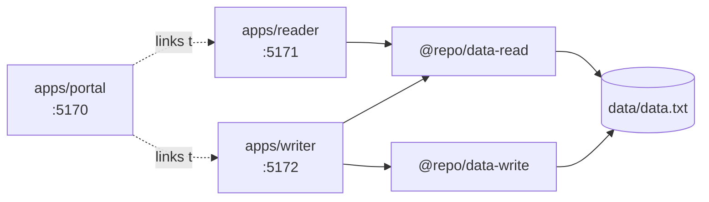

# CLAUDE.md

This file provides guidance to Claude Code (claude.ai/code) when working with code in this repository.

## Repository Nature

`uebungen` is a mixed practice/exercises repository, not a single product. Root-level files (`hallo.md`, `egal.txt`, `jp/*.py`, `jp/*.cpp`, `jp/*.ipynb`, `jp/*.pdf`, `25Jan2021/`) are disconnected snippets, course artifacts, and one-off scripts — treat them as throwaway unless the user points to one specifically.

The two actual sub-projects live under `jp/` and each has its own tech stack, commands, and conventions:

| Path | Stack | Has own CLAUDE.md? |
|---|---|---|
| `jp/tool-helper/` | FastAPI + SQLAlchemy + SQLite backend; Svelte + TS + Vite SPA frontend | Yes — read it first |
| `jp/svelt-tests/mono-repo-test/` | pnpm + Turborepo + SvelteKit 2 + Svelte 5 monorepo | No |

When the user asks you to work inside one of these, `cd` mentally into it — dependencies, scripts, and configs are local to each.

## `jp/tool-helper/`

See `jp/tool-helper/CLAUDE.md` for the full data model (template-instance pattern: TOOL → CHECK_LIST → CHECK_LIST_POINT with parallel `*_TEMPLATE` entities linked via junction tables). Key rules from that file worth surfacing:

- Templates are immutable after instantiation — changing a template must not affect existing checklists.
- `check_list_point_template_id` is nullable — points can exist without a template.
- Schema changes: edit `backend/app/models.py` and delete `backend/tool_helper.db` to recreate. The backend auto-seeds sample data on first run.

**Commands** (run from `jp/tool-helper/`):
- Backend: `pip install -r backend/requirements.txt`, then `uvicorn app.main:app --reload` from `backend/` → http://localhost:8000 (docs at `/docs`)
- Frontend: `npm install`, then `npm run dev` from `frontend/` → http://localhost:5173 (proxies API via Vite)
- Frontend type-check: `npm run check`

## `jp/svelt-tests/mono-repo-test/`

pnpm workspace + Turborepo. Three SvelteKit apps share state through a single file `data/data.txt`, accessed via two internal library packages.

**Architectural conventions to preserve:**
- Packages expose two entry points via `exports` map: `.` (Svelte components, client-safe) and `./server` (Node-only, uses `node:fs`). Server-only code must stay behind the `./server` subpath so client bundles don't pull in `node:fs`.
- Apps locate the data dir with `resolve(process.cwd(), '../../data')` in `+page.server.ts` — this relies on dev servers running from each app's own directory. Don't hardcode absolute paths.
- Shared tooling packages (`@repo/eslint-config`, `@repo/typescript-config`) are consumed as `workspace:*` dev deps — extend these rather than adding per-app lint/tsconfig from scratch.
- Package builds use `svelte-package` and emit to `dist/`. When editing a package, downstream apps consume `dist/`, so a package rebuild (`turbo run build`) is needed before `dev` picks up library changes — Turbo's `build` task has `dependsOn: ["^build"]` to enforce this for `lint`/`check`.

**Commands** (run from `mono-repo-test/` root, via pnpm):
- `pnpm dev` — Turbo runs all apps in parallel (portal:5170, reader:5171, writer:5172)
- `pnpm build` / `pnpm lint` / `pnpm check` — Turbo pipeline across workspace
- `pnpm format` — Prettier on all `.{ts,js,svelte,json,css,md}`
- Single app: `pnpm --filter @repo/reader dev` (or `@repo/writer`, `@repo/portal`)
- Single package: `pnpm --filter @repo/data-read build`

**Package manager is pinned** to `pnpm@10.30.3` via `packageManager` field. Don't switch to npm/yarn.

## Global conventions (from user's ~/.claude/CLAUDE.md)

- Diagrams must be Mermaid, not ASCII art.
- Use Context7 (`mcp__context7__resolve-library-id` → `mcp__context7__query-docs`) for any library/framework questions before relying on training knowledge — applies to FastAPI, SvelteKit, Svelte 5, Turborepo, etc.
- Never use `cd` in Bash commands; use absolute paths so commands stay within the working directory's permission scope.
