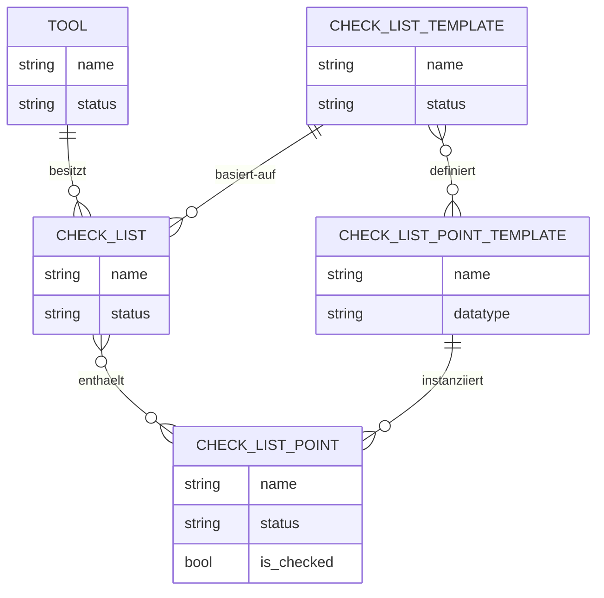
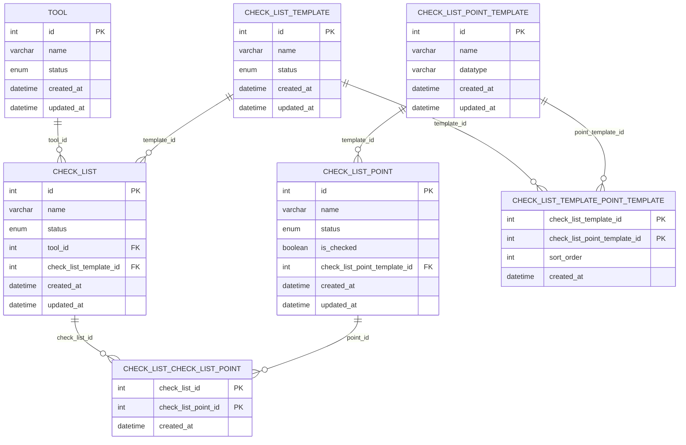

## Entitäten und Attribute

### ERD (Konzeptionelles Modell)

### TOOL

* **id** (PK, int)
* name (str)
* status (enum)

---

### CHECK_LIST

* **id** (PK, int)
* name (str)
  _toggle--??
  Wait.

Let's read diagram carefully mentally.

Entities:

TOOL
id PK int
name str
status enum
(Row 3 placeholder ignore)

CHECK_LIST
id PK int
name str
status enum

CHECK_LIST_TEMPLATE
id PK int
name str
status enum

CHECK_LIST_POINT
id PK int
name str
status enum
is_checked bool

CHECK_LIST_POINT_TEMPLATE
id PK int
name str
datatype ? (probably enum or str, shown as "datatype?")

Junction tables:

CHECK_LIST_CHECK_LIST_POINT
(name shown as "CHECK LIST CHECK LIST POINT")

* check_list_id (FK, int)
* check_list_point_id (FK, int)

CHECK_LIST_TEMPLATE_CHECK_LIST_POINT
(name shown as "CHECK LIST TEMPLATE CHECK LIST POINT")

* check_list_temp_id (FK, int)
* check_list_point_temp_id (FK, int)

---

## Beziehungen (Kardinalitäten)

1. TOOL ↔ CHECK_LIST

* TOOL (1) —— (0..N) CHECK_LIST
  → Ein Tool hat 0 bis N Checklisten
  → Eine Checkliste gehört genau zu einem Tool

2. CHECK_LIST ↔ CHECK_LIST_TEMPLATE

* CHECK_LIST_TEMPLATE (1) —— (0..N) CHECK_LIST
  → Eine Checklisten-Vorlage kann für 0 bis N Checklisten verwendet werden
  → Eine Checkliste basiert auf genau einer Vorlage

3. CHECK_LIST ↔ CHECK_LIST_POINT (Many-to-Many)

* Realisiert über **CHECK_LIST_CHECK_LIST_POINT**
* CHECK_LIST (1) —— (0..N) CHECK_LIST_CHECK_LIST_POINT
* CHECK_LIST_POINT (1) —— (0..N) CHECK_LIST_CHECK_LIST_POINT

→ Eine Checkliste enthält 0 bis N Checklisten-Punkte
→ Ein Checklisten-Punkt kann in 0 bis N Checklisten vorkommen

4. CHECK_LIST_TEMPLATE ↔ CHECK_LIST_POINT_TEMPLATE (Many-to-Many)

* Realisiert über **CHECK_LIST_TEMPLATE_CHECK_LIST_POINT**
* CHECK_LIST_TEMPLATE (1) —— (0..N) CHECK_LIST_TEMPLATE_CHECK_LIST_POINT
* CHECK_LIST_POINT_TEMPLATE (1) —— (0..N) CHECK_LIST_TEMPLATE_CHECK_LIST_POINT

→ Eine Checklisten-Vorlage enthält 0 bis N Punkt-Vorlagen
→ Eine Punkt-Vorlage kann in 0 bis N Checklisten-Vorlagen vorkommen

5. CHECK_LIST_POINT_TEMPLATE ↔ CHECK_LIST_POINT

* CHECK_LIST_POINT_TEMPLATE (1) —— (0..N) CHECK_LIST_POINT
  → Aus einer Punkt-Vorlage entstehen 0 bis N konkrete Checklisten-Punkte
  → Jeder Checklisten-Punkt basiert auf genau einer Punkt-Vorlage

### Relationales Datenbank Model (Physisches Modell)

